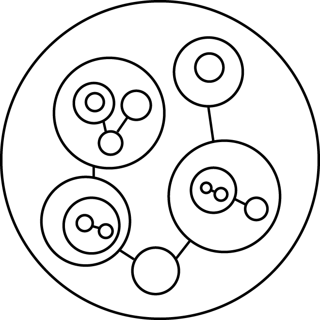

# *This specification is a draft, with work in progress.*

# Chil Language Specification (Edition No. 1, June 2018)

Copyright (c) 2017-2018 Alex Yuly. Distributed under the MIT license.

## Introduction

This standard defines the first edition of the Chil Language. Chil is a dynamic application programming language for expressing informational hierarchies formed by components. The *Chil* name is an acronym for *component hierarchy information language*.

The fundmental unit of traditional object-oriented systems is a *class*, which is a prototype for a [closure](https://en.wikipedia.org/wiki/Closure_(computer_programming)) whose interface consists of a set of public functions called *methods*. Methods form the bridge of communication between instances of classes, called *objects*.

In terms of a directed object graph, classes result in a high degree of bidirectional data flow, since in order for interaction to occur, an instance of class A must delegate control to an instance of class B, which returns to class A.

Moreover, pervasive object-oriented languages like C++, Java, and JavaScript, support freely inheriting and overriding methods in order to define the particular control flow of a class. Method inheritance and overrides tightly couple children to their parents, since a change in the behavior of an inherited parent method, or the removal of a parent override, result in unclear consequences as to the behavior of child methods. This creates a domino effect which makes software unmaintainable, by causing base classes to become the base of a house of cards which can't be moved without destroying the system.

Worse yet, objects may freely pass references around the object graph, allowing references to travel and live arbitrarily far from their objects. If class A passes a reference to its own private field to a method of class B, then class B has access to private data (or perhaps even functions) of class A, which violates object-oriented encapsulation.

Chil is organized around components, which are composed of instances of other components. Functions are replaced by streams, which are organized into components instead of classes. In terms of data flow, streams are unidirectional while functions are bidirectional. Streams are autonomous, while functions are tools. A stream listens for incoming data and sends outgoing data, of its own accord. A function is called by a subject in order to manipulate an object.

Chil is a *push* system, in a world where most object-oriented languages are *pull* systems. *Push* is the design philosophy that objects should 1) report their own status, and 2) listen for the status of other objects. An object should never access the data of another object, nor should it ever directly control the behavior of another object. In this way, object responsibilities are well encapsulated, and data flow is separate from control flow.

*Pull* is the design philosophy that objects should 1) allow other objects to fetch their status, and 2) allow other objects to directly control their behavior. In this way, object responsibilities are not encapsulated at all, and data and control flow are mixed, which makes control flow harder to reason about, and data flow harder to change.

## 1 Compiler architecture

The source code for a Chil application is expressed as any number of YAML files. A single source file, called the *root component*, is passed as an argument to the compiler, which enters the application's object graph at that point and outputs a consolidated representation of the parent-child relationship tree, combined with the sibling relationship graph encapsulated by each object. Compiler output is in the form of *Chil intermediate code* (*CIC*), expressed as a single JSON file. CIC is parsed by a Chil runtime engine which executes the code on a specific platform such as Node.js. The use of an intermediate language allows Chil to be decoupled from any particular runtime environment.

The object graph of a Chil application could be represented something like the following image, where the outermost circle depicts the root component:



Figure 1.1: a visual representation of parent-child relationships (overlapping circles) and sibling relationships (connected circles)

## 2 Source code

Chil source code is formatted according to the [YAML 1.2 specification](http://yaml.org/spec/1.2/spec.html). Each source file has an extension of either `.domain` or `.layout`, according to its purpose. The purpose of a layout source file is to define the flow of data through each stream of a component. A component is a collection of streams which receive input and send output on behalf of the component. The data flow of each stream is delegated to a stream of a "child" component.

The purpose of a domain source file is to define the types of data permitted to be sent into each stream of a component. Each component must have a layout file, but the domain file is optional. If no domain file exists, then each input stream will be permitted to receive any value. If a domain file does exist, then any input stream for which no domain is specified will be permitted to receive any value, as well.

### 2.1 Domain source files

The optional domain source file for a given component is expressed as a YAML document with a dictionary mapping names of input streams, to the types of data permitted to be sent to those inputs. This forms the *domain* of a component. A type of data is defined as a set of values. Some types are inherent to chil and may be referenced in any domain file.

#### 2.1.1 Numbers

The type of data which includes all valid JSON numbers is expressed as `number`. So, an example of a simple domain file for a component with one input which accepts only numbers might look like

```yaml
main: number
```

The types of data which include numbers which are less than, greater than, less than or equal to, and greater than or equal to, are expressed as key-value pairs:

```yaml
under: literal number value
over: literal number value
under ?: literal number value
over ?: literal number value
...
```

#### 2.1.2 Strings

The type of data which includes all valid JSON strings is expressed as `string`.

The type of data which includes strings which match a given regular expression, is expressed as

```yaml
match: regular expression
```

#### 2.1.3 Lists

The type of data which includes all valid JSON Arrays is expressed as `list`. The type of Arrays whose elements are constrained to a specific type is expressed as `list: type`.

#### 2.1.4 Lookups

The type of data which includes all valid non-Array JSON Objects is expressed as `lookup`. The type of Objects for which certain properties are constrained to specific types is expressed as

```yaml
lookup:
  key 1: type 1
  key 2: type 2
  ...
```

Unspecified keys are not constrained to any type. Regular expressions are valid keys, against which actual keys will be tested, and if matching, those keys will be constrained to the given type.

#### 2.1.5 Literal values

The type of data which is constrained to a single literal value of any type, is expressed as a key-value pair:

```yaml
?: literal value
```

#### 2.1.6 Union of types

The type of data which includes the union of an unordered sequence of types of data, is expressed as

```yaml
union:
  - type 1
  - type 2
...
```

An enumeration is defined by a union of literal values:

```yaml
union:
  - ?: literal value 1
  - ?: literal value 2
  ...
```

#### 2.1.6 Intersection of types

The type of data which includes the intersection of an unordered sequence of types of data, is expressed as

```yaml
intersect:
  - type 1
  - type 2
...
```

The compiler emits a warning if any intersected types are disjoint, meaning that they share no common values and the resulting set is empty.

#### 2.1.7 Inverse of a type

The type of data which includes all values which are not included in a given type, is expressed as

```yaml
not: type
```
